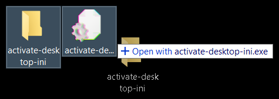

# activate_desktop_ini


Cloned repos don't show my nice folder icons?
Download `activate-desktop-ini.exe` and drag the folder onto it.

## usage



Alternatively:

```shell
$ git clone https://github.com/coalpha/repo cloned-repo
$ activate-desktop-ini cloned-repo
```
